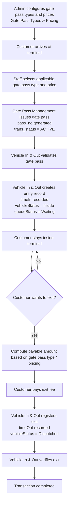
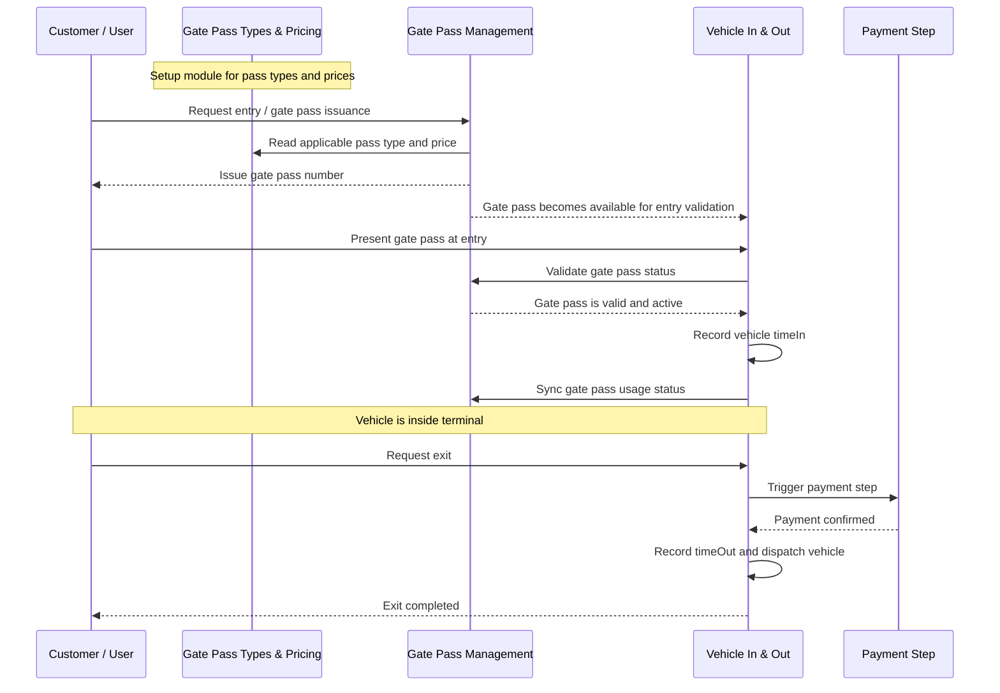

# Gate Pass Module Flow

This flow covers these modules:

- `Gate Pass Types & Pricing`
- `Gate Pass Management`
- `Vehicle In & Out`

It follows the business rule you described:

1. Customer enters the terminal.
2. A gate pass is issued.
3. Vehicle In & Out logs the vehicle as inside.
4. Payment only happens when the customer decides to exit.

## Business Flow Diagram

## Module Interaction Diagram

## Current Code Notes

- `Gate Pass Types & Pricing` stores pass type and final price setup data.
- `Gate Pass Management` issues the gate pass and stores `pass_no`, `vehicle`, `driver`, `route`, `issue_datetime`, `expiry_datetime`, and `trans_status`.
- `Vehicle In & Out` validates the gate pass, records `timeIn`, manages inside/dispatched state, and records `timeOut`.
- In the current codebase, payment is not yet implemented inside these three modules.
- The current `Vehicle In & Out` flow changes gate pass status from `ACTIVE` to `USED` once entry is recorded.
- There is no direct foreign-key link yet from `Gate Pass Management` to `Gate Pass Types & Pricing`, so pricing is currently a business reference step rather than a persisted module-to-module relation.
